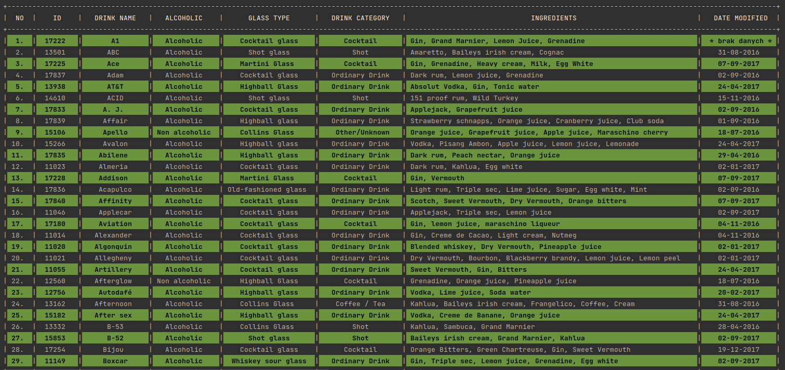
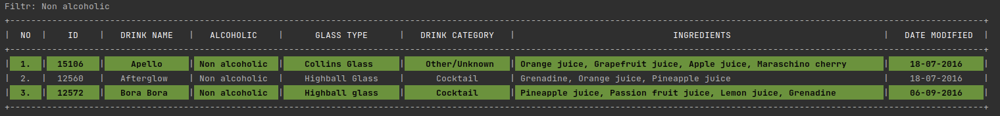

Group name:  **Responsible Drinkers Inc.**

Authors:  **Shirley**, **Kamil**, [**Tomek**](https://github.com/tomek-jaworski-elb)  

------------

## **1st Sprint.** 
##### Console Application with text menu and console input interaction with user.

_Main menu_ 

_List of elements_ 

_Single element_ 

_List filtered by ..._ 

_List sorted by ID_ 

Date:  March 2022

--------------------------
Data taken from: 
| API |	[Free API | TheCoctailDB.com](https://www.thecocktaildb.com/api.php)	|

Build JAR with dependencies by command: 
`mvn clean compile assembly:single`
